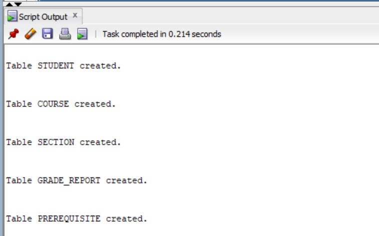
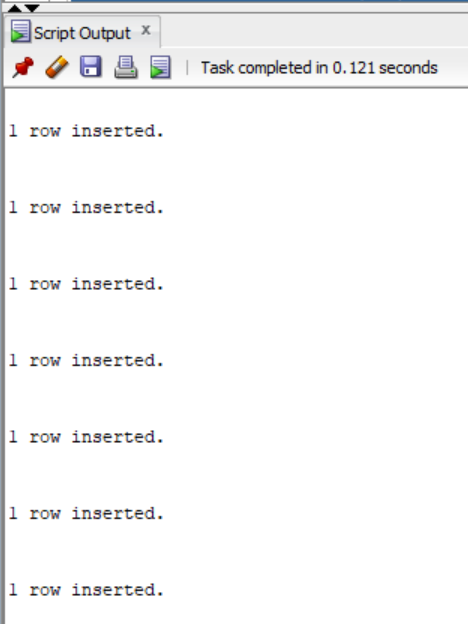
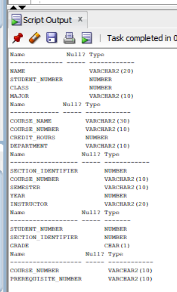
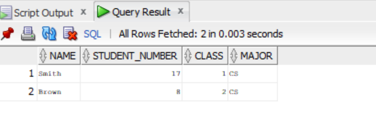
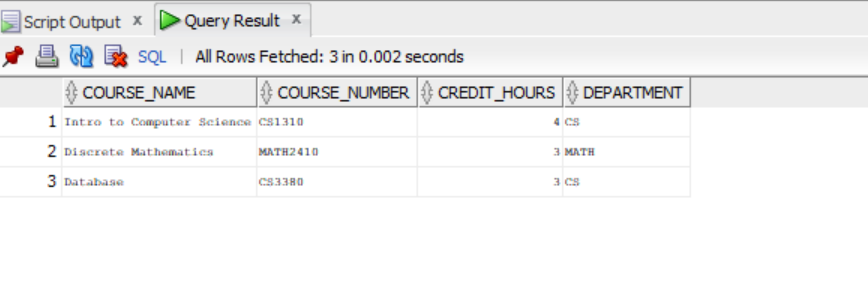
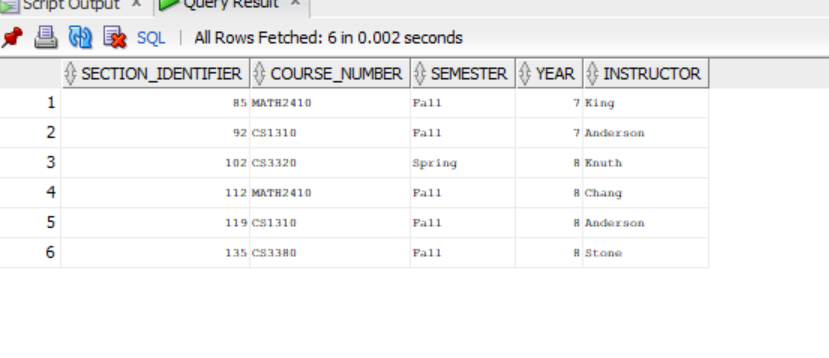
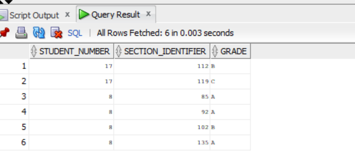
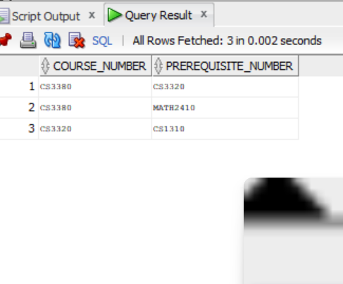

# 1(a) 1.CREATE TABLE
```
CREATE TABLE STUDENT (
    Name VARCHAR2(20),
    Student_number NUMBER,
    Class NUMBER,
    Major VARCHAR2(10)
);

CREATE TABLE COURSE (
    Course_name VARCHAR2(30),
    Course_number VARCHAR2(10),
    Credit_hours NUMBER,
    Department VARCHAR2(10)
);

CREATE TABLE SECTION (
    Section_identifier NUMBER,
    Course_number VARCHAR2(10),
    Semester VARCHAR2(10),
    Year NUMBER,
    Instructor VARCHAR2(20)
);

CREATE TABLE GRADE_REPORT (
    Student_number NUMBER,
    Section_identifier NUMBER,
    Grade CHAR(1)
);

CREATE TABLE PREREQUISITE (
    Course_number VARCHAR2(10),
    Prerequisite_number VARCHAR2(10)
);
```

```
```
# 1(a) 2.INSERT DATA
```
INSERT INTO STUDENT VALUES ('Smith', 17, 1, 'CS');
INSERT INTO STUDENT VALUES ('Brown', 8, 2, 'CS');

INSERT INTO COURSE VALUES ('Intro to Computer Science', 'CS1310', 4, 'CS');
INSERT INTO COURSE VALUES ('Data Structures', 'CS3320', 4, 'CS');
INSERT INTO COURSE VALUES ('Discrete Mathematics', 'MATH2410', 3, 'MATH');
INSERT INTO COURSE VALUES ('Database', 'CS3380', 3, 'CS');

INSERT INTO SECTION VALUES (85, 'MATH2410', 'Fall', 7, 'King');
INSERT INTO SECTION VALUES (92, 'CS1310', 'Fall', 7, 'Anderson');
INSERT INTO SECTION VALUES (102, 'CS3320', 'Spring', 8, 'Knuth');
INSERT INTO SECTION VALUES (112, 'MATH2410', 'Fall', 8, 'Chang');
INSERT INTO SECTION VALUES (119, 'CS1310', 'Fall', 8, 'Anderson');
INSERT INTO SECTION VALUES (135, 'CS3380', 'Fall', 8, 'Stone');

INSERT INTO GRADE_REPORT VALUES (17, 112, 'B');
INSERT INTO GRADE_REPORT VALUES (17, 119, 'C');
INSERT INTO GRADE_REPORT VALUES (8, 85, 'A');
INSERT INTO GRADE_REPORT VALUES (8, 92, 'A');
INSERT INTO GRADE_REPORT VALUES (8, 102, 'B');
INSERT INTO GRADE_REPORT VALUES (8, 135, 'A');

INSERT INTO PREREQUISITE VALUES ('CS3380', 'CS3320');
INSERT INTO PREREQUISITE VALUES ('CS3380', 'MATH2410');
INSERT INTO PREREQUISITE VALUES ('CS3320', 'CS1310');
```



```
```
# 1(a) 3.DESCRIBE TABLES
```

DESC STUDENT;
DESC COURSE;
DESC SECTION;
DESC GRADE_REPORT;
DESC PREREQUISITE;
```

```
```
# 1(a) 4.DISPLAY TABLE DATA
```
SELECT * FROM STUDENT;

SELECT * FROM COURSE;

SELECT * FROM SECTION;

SELECT * FROM GRADE_REPORT;

SELECT * FROM PREREQUISITE;
```





```
```
# 1(a) 5.DELETE TABLES
```
DROP TABLE STUDENT;
DROP TABLE COURSE;
DROP TABLE SECTION;
DROP TABLE GRADE_REPORT;
DROP TABLE PREREQUISITE;
```

```

