# 1B 1. Create tables with constraints
  ```

CREATE TABLE Student (
    Name VARCHAR2(20),
    Student_number NUMBER PRIMARY KEY,
    Class NUMBER,
    Major VARCHAR2(10)
);

CREATE TABLE Course (
    Course_name VARCHAR2(40),
    Course_number VARCHAR2(10) PRIMARY KEY,
    Credit_hours NUMBER,
    Department VARCHAR2(10)
);

CREATE TABLE Section (
    Section_identifier NUMBER PRIMARY KEY,
    Course_number VARCHAR2(10),
    Semester VARCHAR2(10),
    Year NUMBER,
    Instructor VARCHAR2(20),
    CONSTRAINT fk_section_course
    FOREIGN KEY (Course_number)
    REFERENCES Course(Course_number)
);

CREATE TABLE Grade_Report (
    Student_number NUMBER,
    Section_identifier NUMBER,
    Grade CHAR(1),
    CONSTRAINT pk_grade_report
    PRIMARY KEY (Student_number, Section_identifier),
    CONSTRAINT fk_grade_student
    FOREIGN KEY (Student_number)
    REFERENCES Student(Student_number),
    CONSTRAINT fk_grade_section
    FOREIGN KEY (Section_identifier)
    REFERENCES Section(Section_identifier)
);

CREATE TABLE Prerequisite (
    Course_number VARCHAR2(10),
    Prerequisite_number VARCHAR2(10),
    CONSTRAINT pk_prerequisite
    PRIMARY KEY (Course_number, Prerequisite_number),
    CONSTRAINT fk_pre_course
    FOREIGN KEY (Course_number)
    REFERENCES Course(Course_number)
);
```
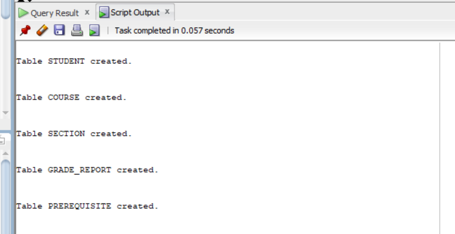
```
# 1B 2. Display description of each table
```
```
DESC Student;
DESC Course;
DESC Section;
DESC Grade_Report;
DESC Prerequisite;
```
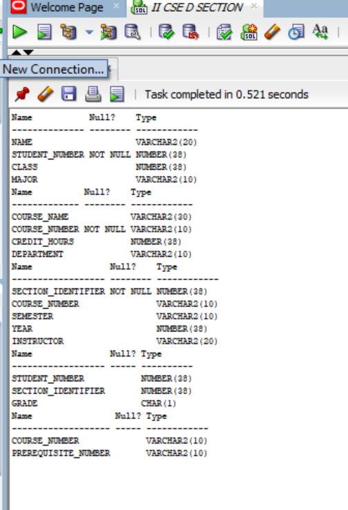
```
# 1B 3. Insert values
```
```
INSERT INTO Student VALUES ('Smith',17,1,'CS');
INSERT INTO Student VALUES ('Brown',8,2,'CS');
INSERT INTO Course VALUES ('Intro to Computer Science','CS1310',4,'CS');
INSERT INTO Course VALUES ('Data Structures','CS3320',4,'CS');
INSERT INTO Course VALUES ('Discrete Mathematics','MATH2410',3,'MATH');
INSERT INTO Course VALUES ('Database','CS3380',3,'CS');
INSERT INTO Section VALUES (85,'MATH2410','Fall',07,'King');
INSERT INTO Section VALUES (92,'CS1310','Fall',07,'Anderson');
INSERT INTO Section VALUES (102,'CS3320','Spring',08,'Knuth');
INSERT INTO Section VALUES (112,'MATH2410','Fall',08,'Chang');
INSERT INTO Section VALUES (119,'CS1310','Fall',08,'Anderson');
INSERT INTO Section VALUES (135,'CS3380','Fall',08,'Stone');
INSERT INTO Grade_Report VALUES (17,112,'B');
INSERT INTO Grade_Report VALUES (17,119,'C');
INSERT INTO Grade_Report VALUES (8,85,'A');
INSERT INTO Grade_Report VALUES (8,92,'A');
INSERT INTO Grade_Report VALUES (8,102,'B');
INSERT INTO Grade_Report VALUES (8,135,'A');
INSERT INTO Prerequisite VALUES ('CS3380','CS3320');
INSERT INTO Prerequisite VALUES ('CS3380','MATH2410');
INSERT INTO Prerequisite VALUES ('CS3320','CS1310');
```

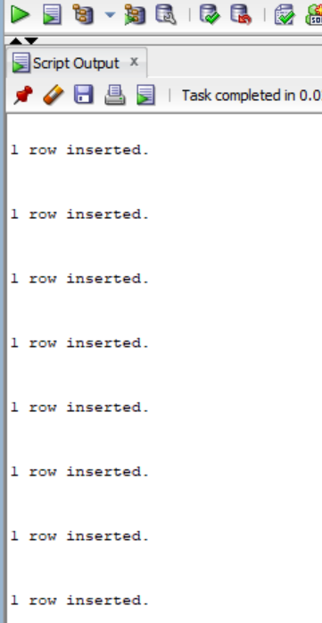

```
# 1B 4. Display instances of each table
```
```
SELECT * FROM Student;
SELECT * FROM Course;
SELECT * FROM Section;
SELECT * FROM Grade_Report;
SELECT * FROM Prerequisite;
```
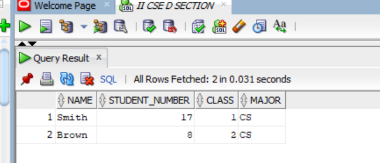
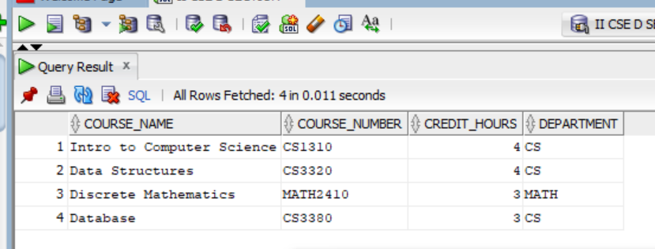
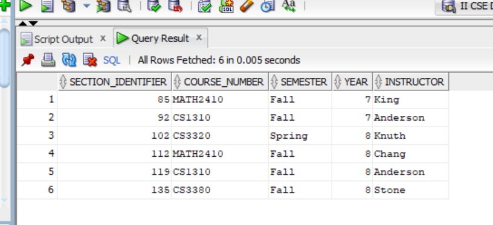
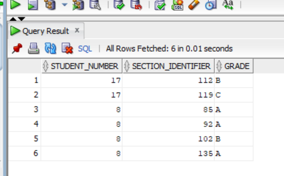
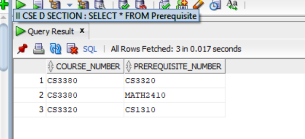
```
# 1B 5. Display all Branch attributes in Student and describe table
```
```

ALTER TABLE Student
ADD Branch VARCHAR2(10);
SELECT Branch FROM Student;
DESC Student;
```
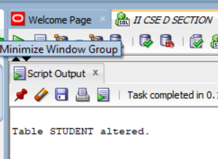
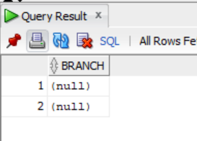
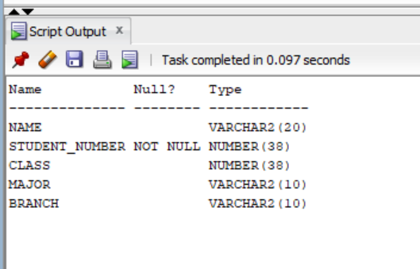
```
# 1B 6. Copy Major values into Branch and display
```
```
UPDATE Student
SET Branch = Major;

SELECT Major, Branch
FROM Student;
```
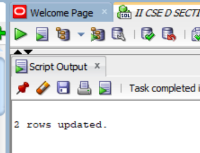
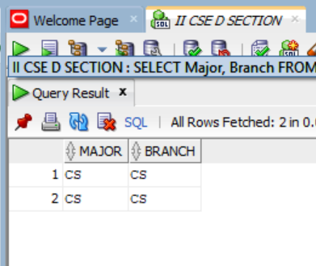
```
# 1B 7. Remove Major attribute from Student
```
```
ALTER TABLE Student
DROP COLUMN Major;

DESC Student;
```
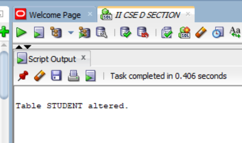
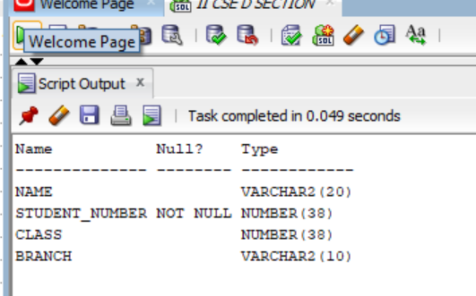
```
# 1B 8. Change Course_number to CID in Course
```
```
ALTER TABLE Course
RENAME COLUMN Course_number TO CID;
```
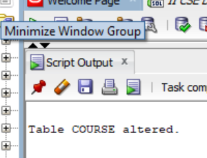
```
# 1B 9. Change Credit_hours of Database to 4
```
```
UPDATE Course
SET Credit_hours = 4
WHERE Course_name = 'Database';
SELECT * FROM Course;
```

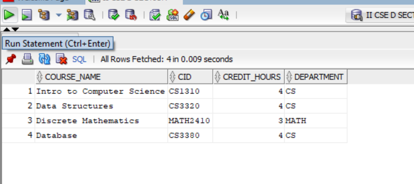
```
# 1B 10. Put NOT NULL constraint on Branch in Student
```
```
ALTER TABLE Student
MODIFY Branch VARCHAR2(10) NOT NULL;
```
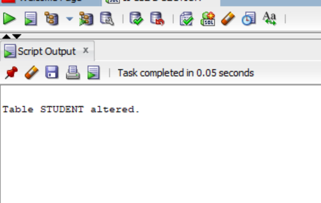
```
# 1B 11. Rename Student table to Pupil
```
```
RENAME Student TO Pupil;
```
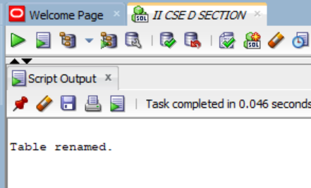
```
# 1B 12. Remove the Student table
```
```
DROP TABLE Pupil CASCADE CONSTRAINTS;
```
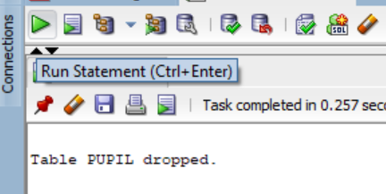
```
# 1B 13. Remove rows having Fall semester in Section
```
```
DELETE FROM Grade_Report
WHERE Section_identifier IN (
    SELECT Section_identifier
    FROM Section
    WHERE Semester = 'Fall'
);
DELETE FROM Section
WHERE Semester = 'Fall';
```
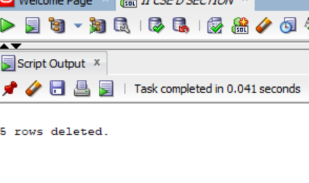
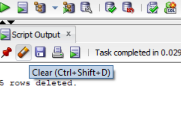
```
# 1B 14. Remove the row of Data_Structures in Course
```
```
DELETE FROM Course
WHERE Course_name = 'Data Structures';
SELECT * FROM Course;
```
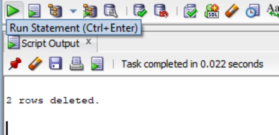
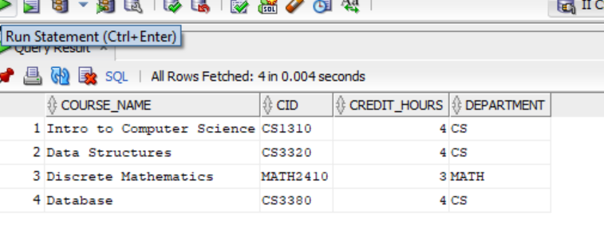
```
# 1B 15. Remove all rows using TRUNCATE
```
```
TRUNCATE TABLE Grade_Report;
TRUNCATE TABLE Prerequisite;
TRUNCATE TABLE Section;
TRUNCATE TABLE Course;
```
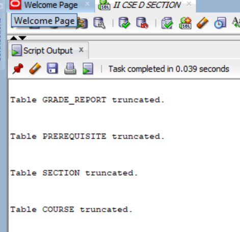
```
# 1B 16. Remove Pupil, Course and Section so they exist in Recycle Bin
```
```
DROP TABLE Pupil;
DROP TABLE Course;
DROP TABLE Section;
```
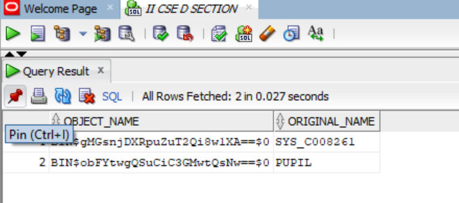
```
# 1B 17. Permanently remove Grade_Report & Prerequisite
```
```
DROP TABLE Grade_Report PURGE;
DROP TABLE Prerequisite PURGE;
```
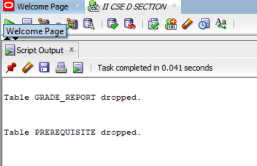
```
